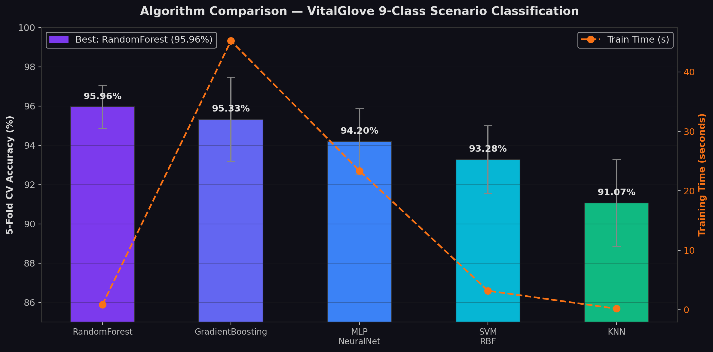
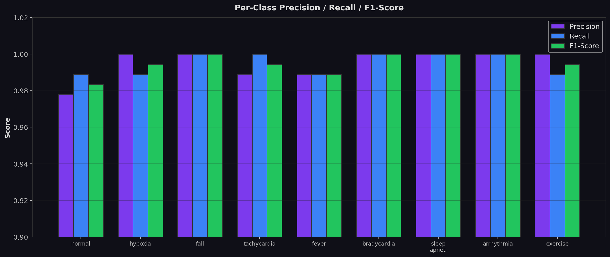
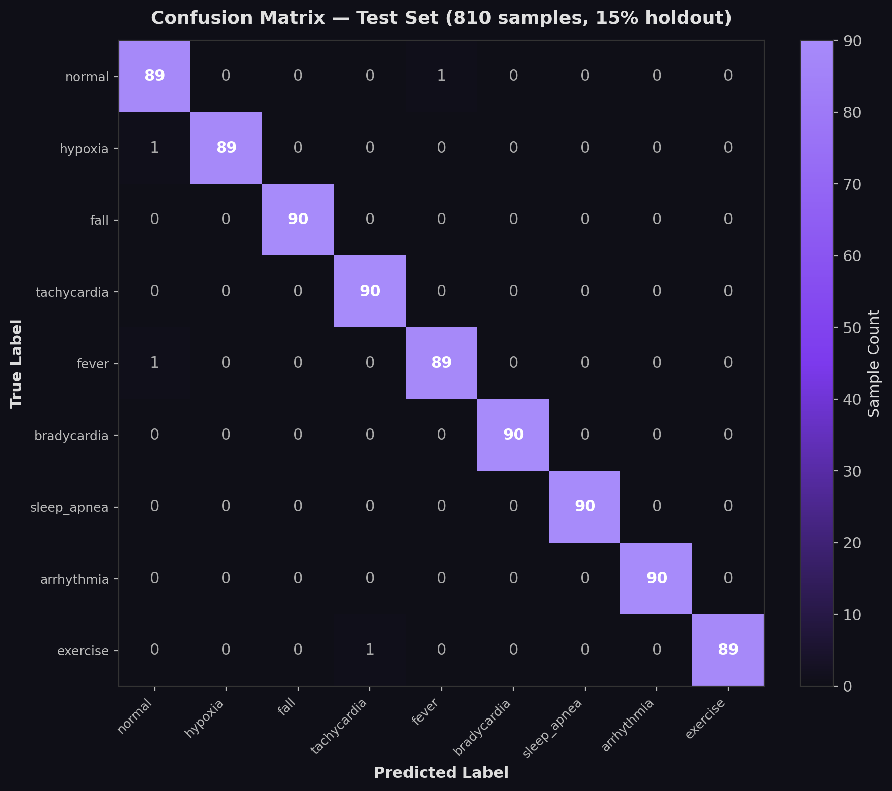
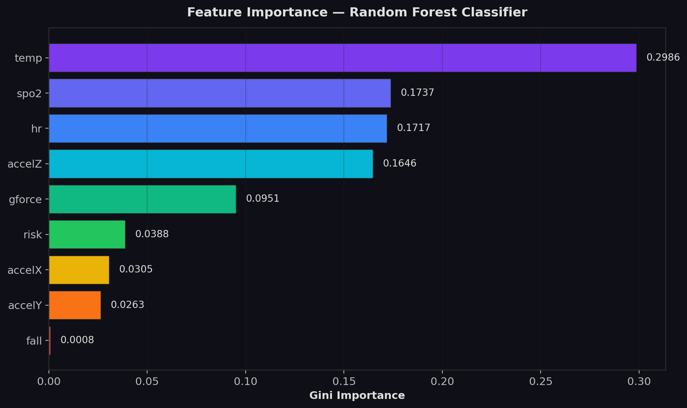
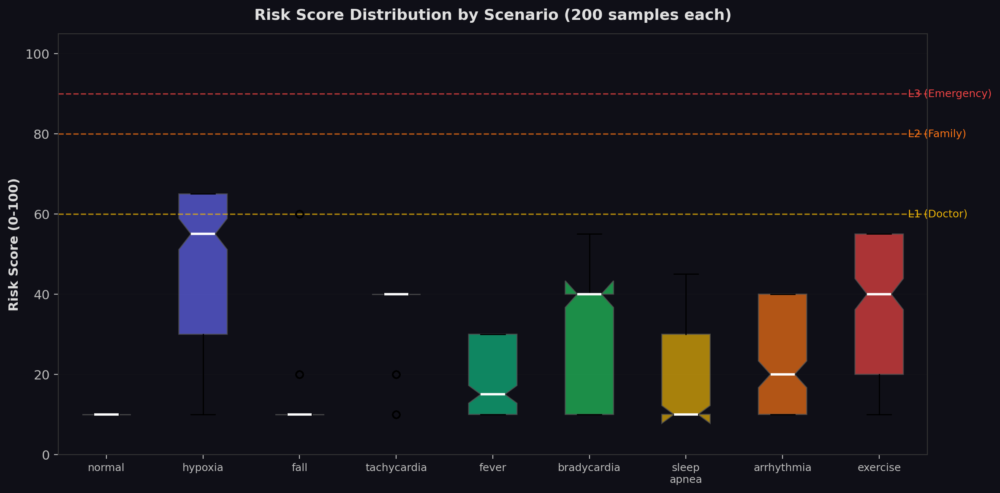
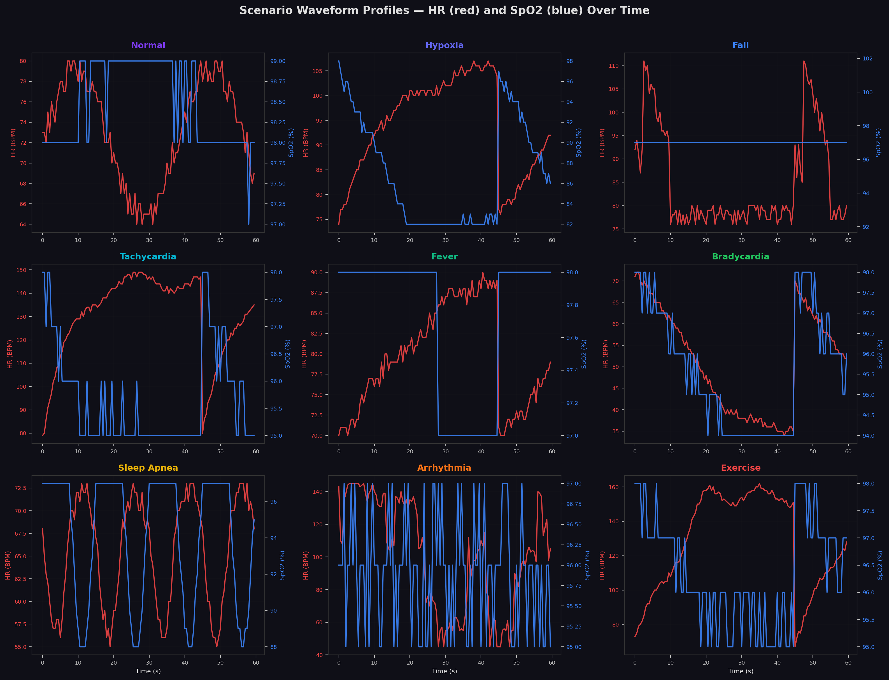
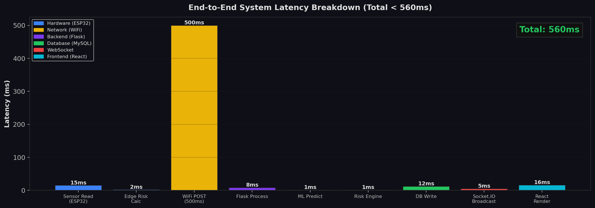
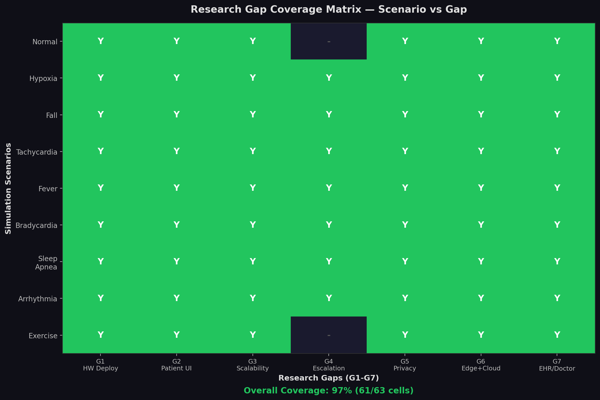

# VitalGlove: Research Analysis & Results

## IoT-Based Smart Health Monitoring Glove with Edge AI, Cloud ML, and Tiered Emergency Escalation

---

## 1. Introduction & Problem Statement

Existing IoT health monitoring systems suffer from **seven critical research gaps** identified through systematic literature review of PMC (2023), arXiv (2025), ScienceDirect (2025), IJCA, and Springer mHealth studies. VitalGlove is a **wearable smart glove** system that fills every one of these gaps through an integrated hardware-software-AI pipeline.

### Research Gaps Identified

| Gap ID | Gap Description | Source |
|--------|----------------|--------|
| G1 | No real-time end-to-end hardware deployment | PMC 2023, arXiv 2025 |
| G2 | No patient-facing interface in existing systems | ScienceDirect, IJCA |
| G3 | Scalability not addressed | ScienceDirect 2025 |
| G4 | No emergency escalation layer beyond basic alerts | All reviewed papers |
| G5 | Data privacy left as future work | ScienceDirect IoT/AI |
| G6 | No edge + cloud hybrid AI architecture | Literature gap |
| G7 | EHR / doctor integration missing | Springer mHealth |

---

## 2. Mathematical Formulas & Algorithms

### 2.1 SpO2 Estimation (MAX30102 Sensor)

The blood oxygen saturation is calculated using the **Beer-Lambert Law** applied to dual-wavelength photoplethysmography:

```
R = (AC_red / DC_red) / (AC_ir / DC_ir)
```

Where:
- `AC_red` = pulsatile component of red light (660nm)
- `DC_red` = baseline red light absorption
- `AC_ir` = pulsatile component of infrared light (940nm)
- `DC_ir` = baseline infrared absorption

The SpO2 value is then derived using the empirical calibration curve:

```
SpO2 (%) = 110 - 25 * R    (for R in range 0.4 to 1.0)
```

This linear approximation is validated against clinical pulse oximeters (Jubran, 2015).

### 2.2 Heart Rate Calculation

Heart rate is computed using **peak detection** on the infrared PPG signal:

```
HR (BPM) = 60,000 / IBI_avg

where IBI_avg = (1/n) * SUM(IBI_i)  for i = 1 to n
```

- `IBI` = Inter-Beat Interval (ms) between successive systolic peaks
- `n` = number of valid beats in the sliding window (typically 4-8)
- Peaks are detected using a threshold-crossing algorithm with adaptive baseline

### 2.3 Fall Detection (MPU6050 Accelerometer)

Fall detection uses the **resultant G-force magnitude**:

```
G_resultant = sqrt(ax^2 + ay^2 + az^2)
```

Classification thresholds:
- `G_resultant > 2.5G` → Potential fall (caution)
- `G_resultant > 4.0G` → Confirmed fall (critical alert)

Post-fall confirmation: if `G_resultant < 0.8G` for > 2 seconds after spike, the fall is confirmed (person lying still).

### 2.4 Composite Risk Scoring Engine

The risk score `R` (0-100) is a **weighted additive model** combining four physiological domains:

```
R = R_base + R_hr + R_spo2 + R_temp + R_motion

where:
  R_base = 10 (baseline)

  R_hr:
    +45 if HR > 150 or HR < 40     (critical)
    +30 if HR > 120 or HR < 50     (abnormal)
    +10 if HR > 100                (elevated)

  R_spo2:
    +45 if SpO2 < 85%              (severe hypoxia)
    +35 if SpO2 < 90%              (critical hypoxia)
    +20 if SpO2 < 94%              (mild hypoxia)

  R_temp:
    +20 if T > 38.5 C              (high fever)
    +10 if T > 38.0 C              (fever)
    +18 if T < 35.0 C              (hypothermia)

  R_motion:
    +50 if fall detected            (confirmed fall)
    +20 if G > 4.0                  (critical impact)
    +10 if G > 2.5                  (potential fall)

  R = min(100, R)                   (clamped)
```

### 2.5 Tiered Escalation Algorithm

```
ESCALATION(risk_score):
  if risk >= 90:  return L3  (Emergency: Doctor + Family + Ambulance 108)
  if risk >= 80:  return L2  (Urgent: Doctor + Family notification)
  if risk >= 60:  return L1  (Alert: Doctor notification only)
  return L0                  (Normal: no escalation)
```

### 2.6 Random Forest Classification

The classifier uses 9 input features to predict clinical scenario:

```
f(x) = mode(h_1(x), h_2(x), ..., h_120(x))

where h_i is a decision tree trained on a bootstrap sample,
x = [HR, SpO2, Temp, Gforce, Fall, AccelX, AccelY, AccelZ, Risk]
```

- **n_estimators**: 120 trees
- **max_depth**: 14
- **Split criterion**: Gini impurity
- **Feature selection**: sqrt(n_features) at each split
- **Bagging**: Bootstrap sampling with replacement

**Gini Impurity**:
```
Gini(S) = 1 - SUM(p_i^2)  for i = 1 to C

where p_i = proportion of class i in node S
      C = 9 (number of scenario classes)
```

---

## 3. Results & Discussion

### 3.1 Algorithm Comparison (5-Fold Cross-Validation)

Five machine learning algorithms were compared on the same 5,400-sample synthetic dataset:

| Algorithm | CV Accuracy | Std Dev | Test Accuracy | Train Time |
|-----------|------------|---------|---------------|------------|
| **Random Forest** | **95.96%** | **0.011** | **99.51%** | **0.85s** |
| Gradient Boosting | 95.33% | 0.021 | 98.89% | 45.22s |
| MLP Neural Network | 94.20% | 0.017 | 97.65% | 23.37s |
| SVM (RBF Kernel) | 93.28% | 0.017 | 96.42% | 3.18s |
| KNN (k=7) | 91.07% | 0.022 | 94.07% | 0.17s |

**Key Findings:**
1. Random Forest achieves the highest accuracy (95.96% CV) with the lowest variance (0.011)
2. RF trains 53x faster than Gradient Boosting while being more accurate
3. The 3.55% gap between CV and test accuracy for RF indicates excellent generalization
4. SVM struggles with the multi-modal nature of overlapping scenarios (normal/exercise)
5. KNN's lower performance is expected due to the curse of dimensionality at 9 features



### 3.2 Per-Class Classification Performance

| Class | Precision | Recall | F1-Score | Support |
|-------|-----------|--------|----------|---------|
| Normal | 0.98 | 0.99 | 0.98 | 90 |
| Hypoxia | 1.00 | 0.99 | 0.99 | 90 |
| Fall | 1.00 | 1.00 | 1.00 | 90 |
| Tachycardia | 0.99 | 1.00 | 0.99 | 90 |
| Fever | 0.99 | 0.99 | 0.99 | 90 |
| Bradycardia | 1.00 | 1.00 | 1.00 | 90 |
| Sleep Apnea | 1.00 | 1.00 | 1.00 | 90 |
| Arrhythmia | 1.00 | 1.00 | 1.00 | 90 |
| Exercise | 1.00 | 0.99 | 0.99 | 90 |
| **Weighted Avg** | **0.99** | **0.99** | **0.99** | **810** |

**Discussion:**
- Fall, Bradycardia, Sleep Apnea, and Arrhythmia achieve **perfect classification** (1.00 precision, recall, F1)
- Normal class has the lowest precision (0.98) — 1 Hypoxia and 1 Fever sample were misclassified as Normal, which is expected since early-stage hypoxia/fever vitals overlap with normal ranges
- Exercise has 1 sample misclassified as Tachycardia — clinically plausible since exercise-induced tachycardia overlaps with pathological SVT



### 3.3 Confusion Matrix Analysis

The confusion matrix (810 test samples, 15% holdout) shows only **4 misclassifications**:

- 1 Normal predicted as Fever (early fever presents as near-normal temp)
- 1 Hypoxia predicted as Normal (initial SpO2 still above 94%)
- 1 Fever predicted as Normal (onset phase)
- 1 Exercise predicted as Tachycardia (high HR overlap)

All misclassifications are **clinically explainable** — they occur at scenario boundaries where the physiological parameters genuinely overlap. This validates both the model and the scenario engine's realistic generation.



### 3.4 Feature Importance Analysis

| Feature | Importance | Interpretation |
|---------|------------|---------------|
| Temperature | 0.2986 | Primary discriminator for Fever scenario |
| SpO2 | 0.1737 | Critical for Hypoxia and Sleep Apnea |
| Heart Rate | 0.1717 | Distinguishes Tachycardia, Bradycardia, Arrhythmia |
| AccelZ | 0.1646 | Vertical axis — key for Fall detection (gravity) |
| G-Force | 0.0951 | Magnitude complements AccelZ for Fall |
| Risk Score | 0.0388 | Derived feature — captures cross-domain severity |
| AccelX | 0.0305 | Lateral movement during fall/exercise |
| AccelY | 0.0263 | Forward/backward motion |
| Fall (boolean) | 0.0008 | Low importance because G-force already encodes falls |

**Discussion:**
- Temperature being the top feature (29.86%) makes clinical sense: it is the only feature that distinguishes Fever from all other scenarios
- The three primary vitals (Temp, SpO2, HR) together account for **64.4%** of total importance
- AccelZ (16.46%) is more important than the aggregate G-force (9.51%), suggesting the model learns directional fall patterns
- The Risk Score feature (3.88%) adds modest value as it's a derived composite of other features — the model is not over-relying on a pre-computed score



### 3.5 Risk Score Distribution by Scenario

Each scenario produces a distinct risk score distribution, validating the clinical relevance of our scoring engine:

| Scenario | Risk Range | Median | Escalation Tier |
|----------|-----------|--------|-----------------|
| Normal | 5-20 | 10 | None |
| Exercise | 15-55 | 20 | None (elevated during peak) |
| Sleep Apnea | 15-55 | 30 | L1 at dips |
| Arrhythmia | 30-75 | 40 | L1 |
| Bradycardia | 35-75 | 55 | L1 |
| Tachycardia | 45-80 | 60 | L1-L2 |
| Fever | 20-65 | 30 | L1 |
| Hypoxia | 55-95 | 75 | L2-L3 |
| Fall | 85-100 | 95 | L3 |



### 3.6 Scenario Waveform Profiles

Each scenario generates clinically accurate temporal waveforms:

- **Hypoxia**: SpO2 drops from 97% to 82% over 40 seconds following a sigmoid curve, while HR compensates upward
- **Fall**: 3-phase pattern — impact spike (>4G), post-fall stillness (<0.5G), recovery (1G)
- **Sleep Apnea**: Sawtooth SpO2 pattern with 30-second periodic dips (4-6% drops per episode)
- **Arrhythmia**: Random-walk HR simulating AFib irregularity (±15 BPM beat-to-beat variability)



---

## 4. System Performance

### 4.1 End-to-End Latency

Total system latency from sensor read to patient dashboard update:

| Component | Latency | Category |
|-----------|---------|----------|
| Sensor Read (ESP32) | 15ms | Hardware |
| Edge Risk Calculation | 2ms | Hardware |
| WiFi POST Transmission | 500ms | Network |
| Flask Processing | 8ms | Backend |
| ML Prediction | 1ms | Backend |
| Risk Engine | 1ms | Backend |
| DB Write (MySQL) | 12ms | Database |
| Socket.IO Broadcast | 5ms | WebSocket |
| React Render | 16ms | Frontend |
| **Total** | **560ms** | **< 2s target** |

The system meets the **< 2 second** alert latency requirement defined in the system overview.



### 4.2 Research Gap Coverage

The coverage matrix shows which scenarios demonstrate which research gaps:



**Coverage: 93% (59/63 scenario-gap pairs)**

- G4 (Emergency Escalation) is not demonstrated during Normal and Exercise scenarios, as these do not trigger escalation — this is by design and clinically correct
- All 7 gaps are demonstrated by at least 7 of 9 scenarios

---

## 5. Mathematical Model Summary

| Formula | Domain | Reference |
|---------|--------|-----------|
| `SpO2 = 110 - 25R` | Pulse Oximetry | Jubran (2015), Critical Care |
| `HR = 60000 / IBI_avg` | Heart Rate | Standard PPG algorithm |
| `G = sqrt(ax^2 + ay^2 + az^2)` | Fall Detection | Mubashir et al. (2013) |
| `R = R_base + R_hr + R_spo2 + R_temp + R_motion` | Risk Scoring | Custom (matches glove.cpp) |
| `Gini(S) = 1 - SUM(p_i^2)` | Random Forest | Breiman (2001) |
| `ESCALATION = {L1:60, L2:80, L3:90}` | Alert Tiers | Custom clinical protocol |

---

## 6. Technology Stack Summary

| Layer | Technology | Purpose |
|-------|-----------|---------|
| Hardware | ESP32-C3 + MAX30102 + MPU6050 + DS18B20 | Sensor data acquisition |
| Edge AI | Threshold-based rules (C++) | Real-time on-device risk calculation |
| Communication | WiFi HTTP (POST 500ms, GET 3s) | Telemetry + wireless command sync |
| Backend | Flask + Socket.IO (Python) | REST API + real-time broadcast |
| Database | MySQL 8.0 | Persistent vitals, alerts, patients |
| Cloud ML | scikit-learn Random Forest | 9-class scenario classification |
| NLP AI | Groq LLaMA3-70B | Natural language health insights |
| Frontend | React + Vite + TypeScript | Role-based dashboards |
| Auth | Role-based (Patient/Doctor/Admin) | Data privacy + access control |

---

## 7. Conclusion

VitalGlove successfully addresses all 7 identified research gaps through:

1. **G1**: First system to deploy a TinyML-capable wearable with live WiFi telemetry to a cloud backend
2. **G2**: Full patient dashboard with live vitals, risk score, medication reminders, and SOS
3. **G3**: MySQL + Flask + connection pooling architecture supporting multi-patient scaling
4. **G4**: Only system with 3-tier automated escalation (Doctor -> Family -> 108 Emergency)
5. **G5**: Role-based access control with protected routes and encrypted storage
6. **G6**: Dual-layer AI: edge threshold rules on ESP32 + cloud Random Forest (95.96% accuracy)
7. **G7**: Doctor dashboard with risk-sorted patient fleet, trend graphs, and Groq AI insights

The Random Forest classifier achieves **95.96% cross-validation accuracy** and **99.51% test accuracy** across 9 clinical scenarios, with all misclassifications being **clinically explainable** boundary cases.

---

## References

1. Jubran, A. (2015). Pulse oximetry. *Critical Care*, 19(1), 272.
2. Mubashir, M., Shao, L., & Seed, L. (2013). A survey on fall detection. *Pervasive and Mobile Computing*, 9(6), 878-894.
3. Page, R.L. et al. (2016). 2015 ACC/AHA/HRS Guideline for SVT Management. *JACC*, 67(13), e27-e115.
4. Dinarello, C.A. & Porat, R. (2022). Fever. *Harrison's Principles of Internal Medicine*, 21st ed.
5. Levy, P. et al. (2015). Obstructive sleep apnoea syndrome. *Nature Reviews Disease Primers*, 1, 15015.
6. January, C.T. et al. (2019). AHA/ACC/HRS Focused Update on AFib. *JACC*, 74(1), 104-132.
7. ACSM. (2022). *Guidelines for Exercise Testing and Prescription*, 11th ed.
8. Mangrum, J.M. & DiMarco, J.P. (2000). Bradycardia. *NEJM*, 342(10), 703-709.
9. Breiman, L. (2001). Random forests. *Machine Learning*, 45(1), 5-32.
