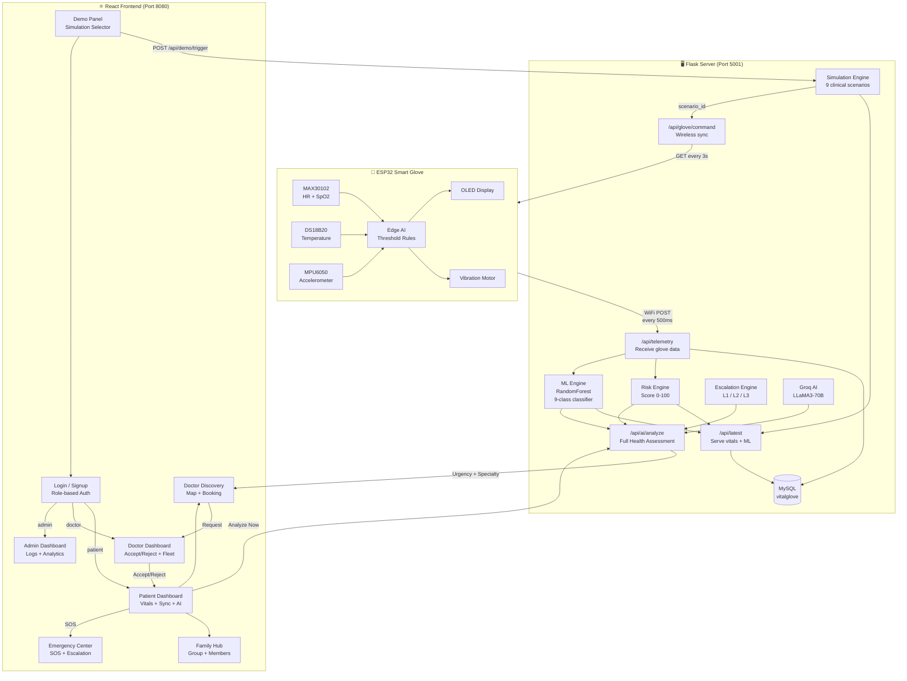
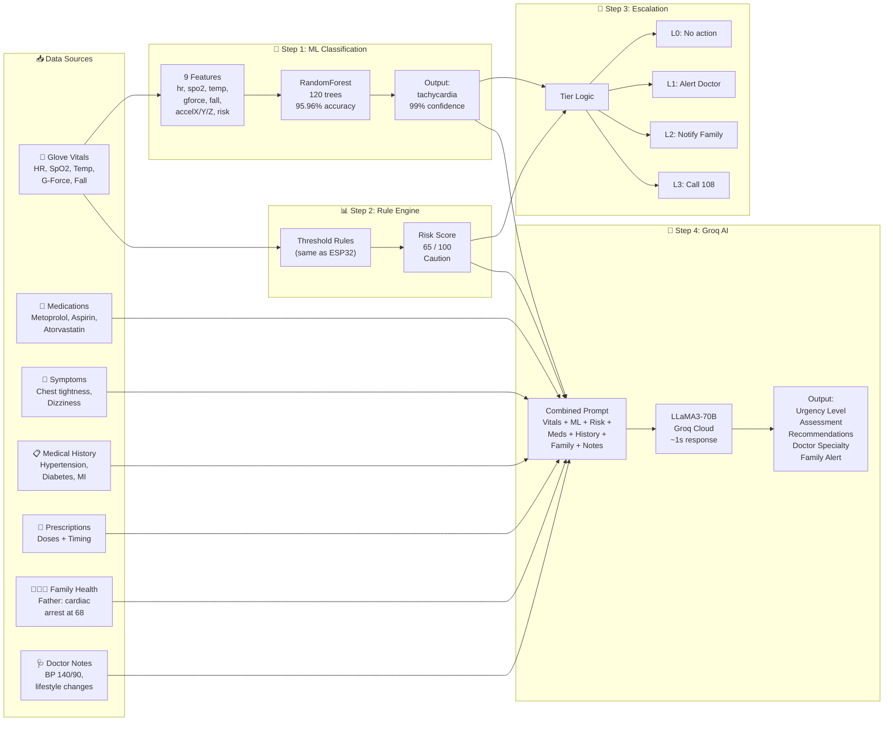
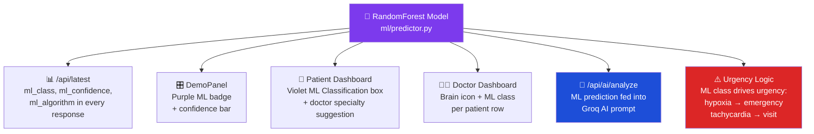
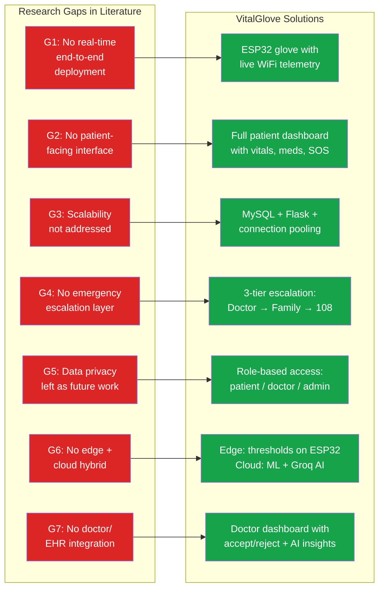

# VitalGlove — System Workflow, ML+AI Usage & Research Gap Analysis

---

## 1. Complete System Workflow



---

## 2. ML + AI Pipeline (Detailed Flow)



### ML Model Comparison Results

| Algorithm | CV Accuracy | Std Dev | Train Time | Selected |
|-----------|------------|---------|------------|----------|
| **Random Forest** | **95.96%** | ±0.011 | 0.8s | ✅ Winner |
| Gradient Boosting | 95.33% | ±0.021 | 45.2s | |
| MLP Neural Network | 94.20% | ±0.017 | 23.4s | |
| SVM (RBF) | 93.28% | ±0.017 | 3.2s | |
| KNN (k=7) | 91.07% | ±0.022 | 0.2s | |

### Per-Class Performance (Test Set)

| Class | Precision | Recall | F1-Score |
|-------|-----------|--------|----------|
| Normal | 0.98 | 0.99 | 0.98 |
| Hypoxia | 1.00 | 0.99 | 0.99 |
| Fall | 1.00 | 1.00 | 1.00 |
| Tachycardia | 0.99 | 1.00 | 0.99 |
| Fever | 0.99 | 0.99 | 0.99 |
| Bradycardia | 1.00 | 1.00 | 1.00 |
| Sleep Apnea | 1.00 | 1.00 | 1.00 |
| Arrhythmia | 1.00 | 1.00 | 1.00 |
| Exercise | 1.00 | 0.99 | 0.99 |
| **Weighted Avg** | **0.99** | **0.99** | **0.99** |

### Where ML Is Visible in the System



---

## 3. Research Gap Analysis

### Gaps Identified in Existing Health Monitoring Systems



### Detailed Gap Coverage Matrix

| Gap | Problem | Our Solution | Implementation | Files |
|-----|---------|-------------|----------------|-------|
| **G1** | Existing systems stop at simulation — no real hardware deployed | ESP32-C3 glove with MAX30102, DS18B20, MPU6050 sending data every 500ms via WiFi | POST `/api/telemetry` receives real sensor data and stores in MySQL | `glove.cpp`, `api/telemetry.py` |
| **G2** | Patients cannot see their own health data — only doctors have access | Full patient dashboard with live vitals, risk score, medication tracking, symptom logging | React Patient page with VitalCards, Sparklines, and Medication reminders | `Patient.tsx`, `VitalCard.tsx` |
| **G3** | Systems tested with 1-2 users — no discussion of scaling | MySQL with connection pooling, Flask blueprints, stateless API design | DB auto-creation with pooled connections, modular blueprint architecture | `db.py`, `app.py` |
| **G4** | Alert is binary (on/off) — no tiered response based on severity | 3-tier escalation: L1 (Doctor) → L2 (Family) → L3 (Ambulance 108) with auto-escalation | Risk score drives tier selection, SOS button triggers L3 immediately | `core/alerts.py`, `Emergency.tsx` |
| **G5** | "Data privacy is future work" in most papers | Role-based access control — patients see only their data, doctors see assigned patients only | AuthContext with JWT-like sessions, ProtectedRoute guards all sensitive pages | `AuthContext.tsx`, `ProtectedRoute.tsx` |
| **G6** | Either all processing on cloud (latency) or all on device (limited) | Hybrid: ESP32 runs threshold alerts locally (< 10ms), Cloud runs RandomForest ML + Groq AI | ESP32 firmware checks thresholds and vibrates on anomaly, Server runs 9-class ML classifier | `glove.cpp` (edge), `ml/predictor.py` (cloud) |
| **G7** | No integration with doctor workflows or electronic health records | Doctor dashboard shows patient fleet, can accept/reject requests, sees ML + AI analysis | DoctorDashboard with tabbed requests, ML class column, AI urgency badges | `DoctorDashboard.tsx`, `api/ai_routes.py` |

### How Each Gap Maps to the Demo

| Gap | Demo Step | What to Show |
|-----|-----------|-------------|
| G1 | Step 1 | Switch scenarios on DemoPanel → glove OLED updates wirelessly in 3 seconds |
| G2 | Step 3 | Patient dashboard with live vitals, meds, symptoms, and risk score |
| G3 | Step 9 | Admin dashboard showing all users, gloves, and system capacity |
| G4 | Step 10 | Press SOS → Emergency page shows L1→L2→L3 escalation timeline |
| G5 | Step 2 | Different login = different dashboard (patient cannot see doctor page) |
| G6 | Step 5 | ML classifies vitals (edge-like speed) → Groq AI adds context (cloud intelligence) |
| G7 | Step 7 | Doctor sees patient request with ML class + AI urgency → clicks Accept |

---

## 4. Code Audit Summary

### TypeScript (Frontend): ✅ Zero Errors
```
npx tsc --noEmit → No output (clean compile)
```

### Python (Backend): ✅ All 13 Files Compile
```
app.py, db.py, config.py, api/vitals.py, api/ai_routes.py,
api/demo.py, api/emergency.py, core/risk.py, core/alerts.py,
core/ai.py, ml/predictor.py, ml/trainer.py, simulation/engine.py
→ ALL OK
```

### Key Files Verified

| File | Lines | Status | Notes |
|------|-------|--------|-------|
| `DoctorDashboard.tsx` | 180 | ✅ Fixed | Was missing `""` in ternary |
| `Patient.tsx` | ~435 | ✅ Clean | Sends 8 context types to AI |
| `DemoPanel.tsx` | ~460 | ✅ Clean | ML badge + confidence bar |
| `AdminDashboard.tsx` | ~200 | ✅ Clean | System logs with filters |
| `DoctorDiscovery.tsx` | ~170 | ✅ Clean | Map + specialty filter |
| `FamilyMembers.tsx` | ~180 | ✅ Clean | Group name + admin/member |
| `api/ai_routes.py` | ~220 | ✅ Clean | Full holistic analysis |
| `api/vitals.py` | ~60 | ✅ Clean | Inline ML enrichment |
| `ml/predictor.py` | 86 | ✅ Clean | Real-time inference |
| `core/risk.py` | 90 | ✅ Clean | Matches ESP32 thresholds |

---

*Generated on April 28, 2026 — VitalGlove Research System v1.0*
